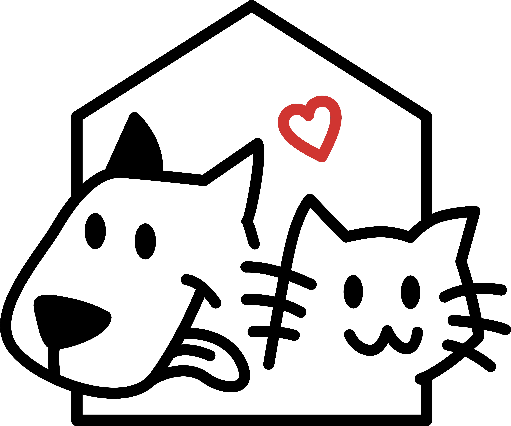

# Lou Lou Design System (露露)

> A chic, modern, approachable design system for **Lou Lou**, a pet-care brand
> shipping on the WeChat Mini Program platform (微信小程序). The system pairs
> warm pastel accents with a confident near-black ink to feel both editorial
> and friendly.



---

## 1 · Brand context

**Lou Lou** is a pet services / lifestyle product. Core offerings inferred from
the moodboard:

- **Grooming bookings** ("Full Service Grooming — Bath, Haircut & Styling")
- **Activity tracking** (walks, miles covered, daily goal progress rings)
- **Category browsing** of pet types (Dog, Cat, Birds, Fish)

The target platform is WeChat Mini Program (微信小程序). All sizing reasoning
uses the 750×1334 rpx baseline; on a 375pt viewport `1px ≈ 2rpx`.

The voice is dual-language: bilingual UI mixing Simplified Chinese
(PingFang SC) with English (SF Pro Text). Tone is warm and informal — talking
*about* pets the way owners do.

### Sources provided

| Source | What it gave us |
|---|---|
| `uploads/LOGO_PNG.png` | Hand-drawn dog + cat under a roof with a red heart — primary mark |
| `uploads/mood.png` | 3-screen moodboard: home with pet category tabs, grooming detail, daily activity dashboard |
| Pasted spec | Loulou 小程序设计系统 v1.0 — colors, radii, shadows, type, 小程序 sizing rules |

> No Figma file, codebase, or production app was attached. This system is
> built from the spec + moodboard, then materialised into living previews and
> a WeChat Mini Program UI kit.

---

## 2 · Content fundamentals (voice & copy)

Lou Lou speaks to pet owners as fellow pet people. The product is a service
companion, not a clinical tool, and the copy reflects that.

**Tone**
- Warm, light, second-person ("Pamper *your* pet, every day").
- Action-oriented in CTAs ("Book Service", "Log New Walk", "View History").
- No exclamation marks in chrome; reserved for empty states / celebrations.
- No marketing fluff. Lines are short and concrete.

**Casing**
- **Titles & nav** use Title Case ("Daily Activity", "Goal Progress",
  "Full Service Grooming").
- **CTAs** Title Case, 2–3 words ("Book Service", "Log New Walk").
- **Tags & chips** Title Case single words or two ("Pet Type", "Coat", "Time").
- **Body copy** sentence case, full sentences with terminal punctuation.

**Pronouns**
- *Your pet* / *your* — never "the user", never "customers".
- First-person plural ("we") is avoided in product UI; reserved for marketing.

**Bilingual rules** (CN/EN)
- 中文 is primary for system chrome on cn-locale; English on en-locale.
- Numerals and units render in SF Pro Text even within Chinese strings
  ("45 min", "2.5 miles", "75% of 60 min").
- Do **not** machine-translate marketing taglines — they're authored per locale.

**Emoji**
- Not used in production UI chrome.
- Allowed sparingly in marketing / push titles (🐾 paw, ❤️) — never in buttons.

**Examples (from moodboard)**
- Hero: *"Pamper Your Pet, Every Day"* / *"Book expert grooming services or track your pet's daily activity."*
- Stat card label: *"Today's Walk"* / value: *"45 min"*
- CTA: *"Book Service"*, *"Log New Walk"*
- Section header: *"Today at a Glance"*, *"Goal Progress"*
- Tag pattern: *"Pet Type — Cat"*, *"Coat — Short"*, *"Time — 30–45 mins"*

---

## 3 · Visual foundations

### Palette

A near-black anchor (`#22282C`) carries every CTA, primary text, and the
dark-pill chrome (e.g. avatar/notification cluster at top of home). Surfaces
are quietly cool — page is an off-white-with-blue-tint `#F8F8FC`, cards are
pure white. Pastels do the emotional work: **butter yellow `#FEE7A6`** and
**lavender `#D8CAE8`** for pet cards, tags, and stat tiles. Optional pastel
extensions (mint, peach) are reserved for category coding and should always
remain low-saturation.

The logo's red heart `#E63946` is the only saturated colour in the system and
appears **only on the logo** — never as a UI accent.

### Type

- **Display / titles** PingFang SC, 700, tight tracking. Headlines are short
  (≤ 16 字 / ≤ 5 English words per line) and may break across 2 lines for
  rhythm.
- **Body / chrome** SF Pro Text / PingFang SC, 400 / 500.
- Numerals are always SF Pro Text — never PingFang — so digits stay tabular
  and clean.

### Spacing & rhythm

- 4-pt scale; `16px` is the workhorse gutter (matches 12pt + safe padding).
- Section vertical rhythm: title → 16px → content → 24px → next section.
- Pet cards stack with a small overlap (~24px offset) for editorial layering
  — see Premium Grooming card on home.

### Backgrounds

- Page is flat `#F8F8FC`. No gradients, no patterns.
- Cards are flat white with a featherweight shadow.
- **Pet imagery** sits over a flat pastel "stage" (butter or lavender),
  knocked out on a transparent PNG so the pet's silhouette breaks the card
  edge. This is the brand's signature visual move.

### Corner radii

- **24rpx (12px)** large cards
- **16rpx (8px)** list items
- **12rpx (6px)** avatars / small cards
- **8rpx (4px)** tags
- **48rpx (pill)** CTAs and category chips
- **0** top nav, bottom tab bar

### Borders & dividers

- Hairline `#EEEEF2`, always 1px (not 1rpx — too thin on retina).
- Borders are used very sparingly; the card shadow does most of the
  separation work.

### Shadows

Two-tier, both extremely soft:
- `0 2px 8px rgba(0,0,0,0.04)` — cards, floating tiles
- `0 4px 12px rgba(0,0,0,0.08)` — popovers, dropdowns, sheets

No coloured shadows, no inner shadows, no neumorphism.

### Animation

- **Easing** `cubic-bezier(0.2, 0, 0, 1)` — WeChat-leaning ease-out for taps.
- **Durations** 120ms (state changes), 240ms (sheets / nav transitions).
- **Hover** is irrelevant on mini-program touch UI; on web previews use a
  -2% lightness shift on the press colour.
- **Press** CTAs darken to `#1A1F23` *and* scale to 0.985 — never bouncy.
- Loading uses a black 24px spinner inside a CTA; the CTA keeps its bg.

### Transparency & blur

- Used only for the disabled CTA (`rgba(34,40,44,0.5)`).
- No backdrop blur, no glassmorphism — this is a flat brand.

### Layout rules

- Fixed top nav (64px) + optional fixed bottom tab bar (49px).
- Content scrolls in the middle; CTAs that close the action (Book Service,
  Log New Walk) are pinned 24px above the bottom safe area.
- Min touch target **44 × 44px** (75rpx baseline + 16px halo for elder users
  per 适老化 rules).

### Imagery vibe

- Warm, natural pet photography on a transparent or pastel ground.
- No filters / no grain. Slightly desaturated, true-to-life colour.
- Pets are framed head-and-shoulders, looking at camera.
- Avoid stock-iness — eyes-on-camera is mandatory for hero pet shots.

### Cards

Two variants:
- **Service card** (white surface, 12px radius, card shadow, internal padding 16px).
- **Pet stage card** (flat pastel bg, 12px radius, no shadow, the pet PNG
  sits over the top edge with negative top margin).

---

## 4 · Iconography

Lou Lou uses **[Phosphor Icons](https://phosphoricons.com)** — a flexible,
finely-drawn open-source icon family. The system uses the **Regular** weight
for chrome and inactive tabs, and **Fill** weight for active tab states.
Icon colour always inherits text colour at the matching layer
(primary / secondary).

```html
<!-- Add to <head> -->
<link rel="stylesheet" href="https://unpkg.com/@phosphor-icons/web@2.1.1/src/regular/style.css">
<link rel="stylesheet" href="https://unpkg.com/@phosphor-icons/web@2.1.1/src/fill/style.css">

<!-- Usage -->
<i class="ph ph-house"></i>           <!-- regular -->
<i class="ph-fill ph-house"></i>      <!-- filled, active -->
```

- Sizes: 20 / 24 / 28 px (set via `font-size`).
- Tab bar: 24px regular when inactive, 24px fill when active.
- Stick to the **regular** weight by default; only reach for **bold** for
  emphasis (e.g. inside a primary CTA). Avoid mixing weights in the same view.

**Emoji** is not used in chrome. **Unicode dingbats** (★, ✓) are allowed
for star ratings and inline confirmation marks only.

**Logo and brand marks** live in `assets/`:
- `assets/logo.png` — primary mark (dog + cat under roof + heart)
- `assets/moodboard.png` — reference moodboard

---

## 5 · Index

| File / folder | What's inside |
|---|---|
| `README.md` | This document |
| `SKILL.md` | Cross-compatible Agent-Skill metadata |
| `colors_and_type.css` | All design tokens as CSS custom properties + semantic element styles |
| `assets/` | Logo, moodboard, brand imagery |
| `preview/` | Self-contained HTML cards used by the Design System tab |
| `ui_kits/wechat-mini-program/` | Pixel-faithful Mini Program UI kit with click-through prototype |

### UI Kits

- **`ui_kits/wechat-mini-program/`** — Mobile (iPhone-frame) prototype of the
  Lou Lou Mini Program. 5 screens: Home, Pet Detail, Daily Activity, Booking
  Sheet, and Tabbed shell. Components factored into individual JSX files.

---

## 6 · Caveats & open questions

- No Figma / production codebase was attached; the system is reconstructed
  from the spec and 3-screen moodboard. Components beyond what the moodboard
  shows (e.g. login, settings, empty states) are inferred.
- No real font files supplied — system uses **PingFang SC / SF Pro Text via
  system stack**, with **Noto Sans SC** as a webfont fallback. Please attach
  real `.ttf` / `.woff2` files if licensing requires.
- Icon set is **substituted with Lucide** — please confirm or attach Lou Lou's
  own icon set.
- Pet photography is placeholder / public-domain in the UI kit. Brand
  photography to be supplied for production.
